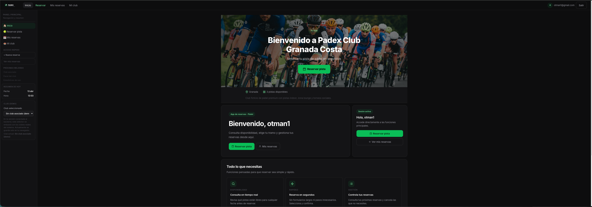
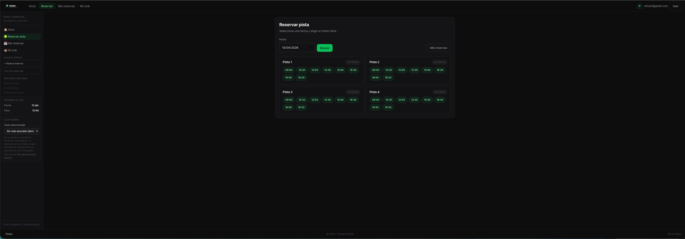
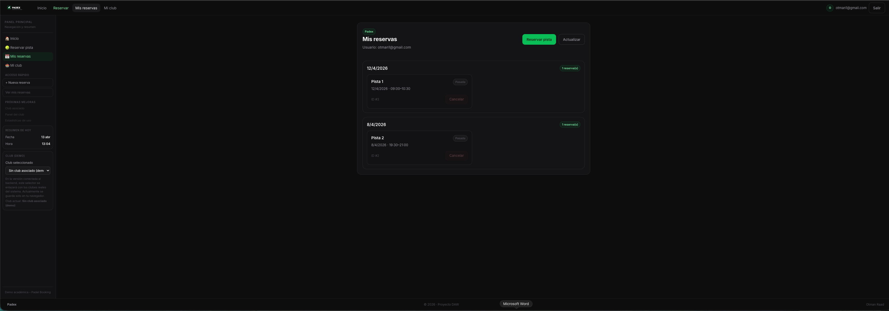
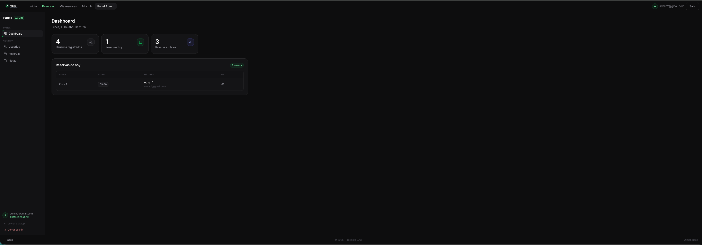
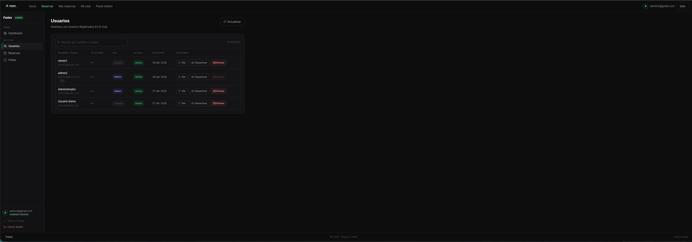

<div align="center">

# 🎾 PADEX

### Reserva pistas de pádel de forma rápida, sencilla y desde cualquier dispositivo.

Una aplicación web completa para la gestión y reserva de pistas de pádel — con panel de usuario, consulta de disponibilidad en tiempo real y panel de administración.

<br/>


</div>

---

## 📸 Preview

| Vista            | Pantalla                                   |
| ---------------- | ------------------------------------------ |
| Inicio           |                  |
| Reserva de pista |          |
| Mis reservas     |  |
| Panel de admin   |      |

---

## ✨ Funcionalidades

**Usuario**

- 🔐 Registro e inicio de sesión con JWT y cookies httpOnly
- 🏟️ Selección de club y consulta de información del club
- 📅 Reserva de pistas por fecha y hora con disponibilidad en tiempo real
- 📋 Gestión de reservas propias (ver y cancelar)

**Administrador**

- 📊 Dashboard con estadísticas generales
- 👥 Gestión completa de usuarios
- 🗓️ Gestión de todas las reservas del club
- 🎾 Gestión de pistas (altas, bajas, configuración)

**Técnico**

- ⚡ Rate limiting en login y registro (protección contra fuerza bruta)
- 🌐 CORS configurable por entorno
- 🔒 Rutas protegidas por rol (usuario / admin)
- 💡 Generación dinámica de slots horarios según configuración del club

---

## 🧱 Estructura del proyecto

```
proyecto-fin-grado/
├── backend/
│   ├── middleware/
│   │   ├── auth.js               # Verifica JWT en rutas de usuario
│   │   └── adminAuth.js          # Verifica rol admin
│   ├── routes/
│   │   ├── auth.routes.js        # Login y registro
│   │   ├── reservations.routes.js
│   │   ├── admin.routes.js
│   │   ├── clubs.routes.js
│   │   └── users.routes.js
│   ├── db.js                     # Pool de conexiones MySQL
│   ├── index.js                  # Punto de entrada del servidor
│   ├── .env.example
│   └── package.json
│
└── frontend/
    ├── src/
    │   ├── components/           # Componentes reutilizables
    │   │   └── admin/            # Componentes del panel admin
    │   ├── pages/                # Páginas de usuario
    │   │   └── admin/            # Páginas del panel admin
    │   ├── context/              # AuthContext (sesión global)
    │   ├── lib/                  # Clientes HTTP
    │   ├── config/               # URL del backend
    │   ├── types/                # Tipos TypeScript
    │   └── App.tsx               # Enrutador principal
    ├── .env.example
    └── package.json
```

---

## 🛠️ Tecnologías

### Backend

| Paquete            | Para qué se usa                      |
| ------------------ | ------------------------------------ |
| Express            | Framework del servidor HTTP          |
| mysql2             | Conexión y consultas a MySQL         |
| jsonwebtoken       | Generación y verificación de JWT     |
| bcryptjs           | Hasheo de contraseñas                |
| cookie-parser      | Lectura de cookies en las peticiones |
| express-rate-limit | Protección contra fuerza bruta       |
| dotenv             | Carga de variables de entorno        |
| nodemon            | Reinicio automático en desarrollo    |

### Frontend

| Paquete            | Para qué se usa                  |
| ------------------ | -------------------------------- |
| React 19           | Librería principal de UI         |
| TypeScript 5       | Tipado estático                  |
| Vite 7             | Bundler y servidor de desarrollo |
| React Router DOM 7 | Enrutado del cliente             |
| Framer Motion      | Animaciones                      |
| React Icons        | Iconos                           |

> Los estilos están hechos a mano con CSS y variables propias. Sin Tailwind ni librerías de componentes.

---

## 🚀 Instalación

### Requisitos previos

- Node.js 18 o superior
- MySQL 8
- npm

### 1. Clona el repositorio

```bash
git clone https://github.com/RaadOtman/proyecto-fin-grado
cd proyecto-fin-grado
```

### 2. Configura el backend

```bash
cd backend
npm install
cp .env.example .env
# Edita .env con tus datos de base de datos y JWT
npm run dev
```

El servidor arrancará en `http://localhost:4000`

### 3. Configura el frontend

```bash
cd ../frontend
npm install
cp .env.example .env
# Edita .env con la URL del backend
npm run dev
```

La app arrancará en `http://localhost:5173`

> El frontend necesita el backend activo para funcionar. Arranca primero el backend.

---

## 🔐 Variables de entorno

### Backend — `backend/.env`

```env
PORT=               # Puerto del servidor (ej: 4000)
NODE_ENV=           # development o production

DB_HOST=            # Host de MySQL (ej: 127.0.0.1)
DB_PORT=            # Puerto de MySQL (ej: 3306)
DB_USER=            # Usuario de MySQL
DB_PASSWORD=        # Contraseña de MySQL
DB_NAME=            # Nombre de la base de datos

JWT_SECRET=         # Clave secreta para firmar los tokens

CORS_ORIGIN=        # URL del frontend en producción
```

### Frontend — `frontend/.env`

```env
VITE_API_URL=       # URL del backend (ej: http://localhost:4000)
```

---

## 📸 Capturas de pantalla

### 🏠 Inicio


### 📅 Reservar pista


### 📋 Mis reservas


### 🏟️ Mi club


### 📊 Admin — Dashboard


### 👥 Admin — Usuarios



### 🗓️ Admin — Reservas


### 🎾 Admin — Pistas


---

## 🎯 Objetivo del proyecto

PADEX es mi proyecto de fin de grado del ciclo superior de Desarrollo de Aplicaciones Web (DAW).

La idea surgió de algo simple: muchos clubs de pádel todavía gestionan las reservas por teléfono o con herramientas muy básicas. Quería construir algo que solucionara eso de verdad.

He intentado ir más allá de lo que se pide en clase: autenticación con cookies httpOnly, panel de administración completo, disponibilidad dinámica de pistas según la configuración del club, y buenas prácticas de seguridad básicas. No es un proyecto perfecto, pero sí uno en el que he aprendido mucho.

---

## 👨‍💻 Autor

**Otman Raad**
Proyecto de Fin de Grado · Ciclo Superior DAW

---

<div align="center">
  <sub>Hecho con ☕ y muchas horas de depuración</sub>
</div>
