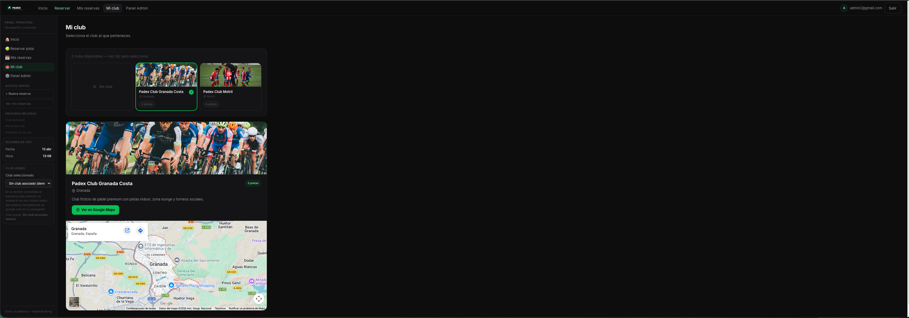

<div align="center">

<br/>

# 🎾 PADEX

### Gestión y reserva de pistas de pádel — rápido, limpio y desde cualquier dispositivo.

<br/>

[](https://react.dev)
[](https://www.typescriptlang.org)
[](https://nodejs.org)
[](https://www.mysql.com)
[](https://vitejs.dev)

<br/>

[🚀 Ver demo](https://padex.vercel.app) &nbsp;·&nbsp; [📸 Capturas](#-capturas-de-pantalla) &nbsp;·&nbsp; [⚙️ Instalación](#-instalación)

<br/>

</div>

---

## 📸 Preview

<div align="center">
  
</div>

<br/>

<div align="center">
  
  &nbsp;
  
</div>

---

## ✨ Funcionalidades

<table>
<tr>
<td width="33%" valign="top">

### 👤 Usuario

- 🔐 Registro e inicio de sesión
- 🏟️ Selección y consulta de club
- 📅 Reserva de pistas por fecha y hora
- 🟢 Disponibilidad en tiempo real
- 📋 Gestión de reservas propias

</td>
<td width="33%" valign="top">

### 🛡️ Administrador

- 📊 Dashboard con estadísticas
- 👥 Gestión de usuarios
- 🗓️ Gestión de todas las reservas
- 🎾 Gestión de pistas

</td>
<td width="33%" valign="top">

### ⚙️ Técnico

- 🔒 JWT con cookies httpOnly
- ⚡ Rate limiting (fuerza bruta)
- 🌐 CORS configurable
- 🔑 Rutas protegidas por rol
- 💡 Slots dinámicos por club

</td>
</tr>
</table>

---

## 🛠️ Tecnologías

<table>
<tr>
<td width="50%" valign="top">

### Backend

| Paquete            | Uso                       |
| ------------------ | ------------------------- |
| Express            | Servidor HTTP             |
| mysql2             | Conexión a MySQL          |
| jsonwebtoken       | Autenticación JWT         |
| bcryptjs           | Hasheo de contraseñas     |
| cookie-parser      | Gestión de cookies        |
| express-rate-limit | Protección contra ataques |
| dotenv             | Variables de entorno      |

</td>
<td width="50%" valign="top">

### Frontend

| Paquete            | Uso                  |
| ------------------ | -------------------- |
| React 19           | Librería de UI       |
| TypeScript 5       | Tipado estático      |
| Vite 7             | Bundler y dev server |
| React Router DOM 7 | Enrutado cliente     |
| Framer Motion      | Animaciones          |
| React Icons        | Iconos               |

> Estilos 100% a mano con CSS y variables propias. Sin Tailwind ni librerías de componentes.

</td>
</tr>
</table>

---

## 🧱 Arquitectura

```
proyecto-fin-grado/
│
├── backend/
│   ├── middleware/
│   │   ├── auth.js               # Verifica JWT (rutas de usuario)
│   │   └── adminAuth.js          # Verifica rol admin
│   ├── routes/
│   │   ├── auth.routes.js
│   │   ├── reservations.routes.js
│   │   ├── admin.routes.js
│   │   ├── clubs.routes.js
│   │   └── users.routes.js
│   ├── db.js                     # Pool de conexiones MySQL
│   ├── index.js                  # Punto de entrada
│   └── .env.example
│
└── frontend/
    └── src/
        ├── components/           # Componentes reutilizables
        │   └── admin/            # Componentes del panel admin
        ├── pages/                # Vistas del usuario
        │   └── admin/            # Vistas del panel admin
        ├── context/              # AuthContext — sesión global
        ├── lib/                  # apiClient + adminApiClient
        ├── config/               # URL base del backend
        ├── types/                # Tipos TypeScript
        └── App.tsx               # Enrutador principal
```

---

## 🚀 Instalación

### Requisitos

- Node.js 18+
- MySQL 8
- npm

### 1 — Clona el repositorio

```bash
git clone https://github.com/RaadOtman/proyecto-fin-grado
cd proyecto-fin-grado
```

### 2 — Backend

```bash
cd backend
npm install
cp .env.example .env   # Rellena las variables con tus datos
npm run dev            # Arranca en http://localhost:4000
```

### 3 — Frontend

```bash
cd ../frontend
npm install
cp .env.example .env   # Añade la URL del backend
npm run dev            # Arranca en http://localhost:5173
```

> El frontend necesita el backend activo. Arráncalos en este orden.

---

## 🔐 Variables de entorno

### `backend/.env`

```env
PORT=               # Puerto del servidor (ej: 4000)
NODE_ENV=           # development | production

DB_HOST=            # Host MySQL (ej: 127.0.0.1)
DB_PORT=            # Puerto MySQL (ej: 3306)
DB_USER=            # Usuario MySQL
DB_PASSWORD=        # Contraseña MySQL
DB_NAME=            # Nombre de la base de datos

JWT_SECRET=         # Clave secreta para firmar tokens

CORS_ORIGIN=        # URL del frontend en producción
```

### `frontend/.env`

```env
VITE_API_URL=       # URL del backend (ej: http://localhost:4000)
```

---

## 📸 Capturas de pantalla

### 🏠 Inicio


### 📅 Reservar pista


### 📋 Mis reservas


### 🏟️ Mi club



### 📊 Admin — Dashboard


### 👥 Admin — Usuarios


---

## 🎯 Objetivo del proyecto

PADEX es mi proyecto de fin de grado del ciclo superior de **Desarrollo de Aplicaciones Web (DAW)**.

La idea vino de algo concreto: la mayoría de clubs de pádel cercanos gestionan las reservas por WhatsApp o por teléfono. Quería construir algo que lo resolviera de forma real, no solo un CRUD para entregar en clase.

He intentado que el proyecto refleje buenas prácticas desde el principio: autenticación con cookies httpOnly en lugar de localStorage, protección contra fuerza bruta, panel de administración completo, disponibilidad de pistas calculada dinámicamente según la configuración del club, y separación clara de responsabilidades entre frontend y backend.

No es un proyecto perfecto, pero sí uno en el que he tomado decisiones con criterio y he aprendido lo que significa construir una aplicación web de principio a fin.

---

## 👨‍💻 Autor

<div align="center">

**Otman Raad**

[](https://github.com/RaadOtman)
[](https://www.linkedin.com/in/otman-raad-951044353/)

Ciclo Superior DAW · Proyecto de Fin de Grado

</div>

---

<div align="center">
  <sub>Hecho con ☕ y muchas horas de depuración</sub>
</div>
